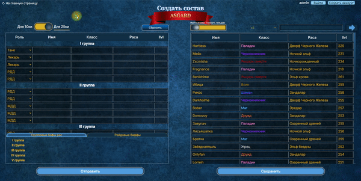
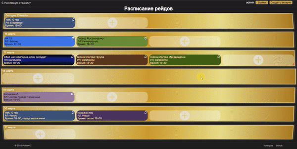
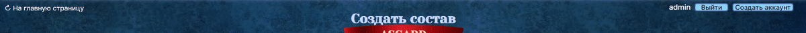

# Сайт гильдии, для игры World of Warcraft

## https://wow-sirus.online

**предназначен для проекта [sirus.one](https://sirus.one/)*

# Описание 
Сайт представляет из себя информационный портал для игроков гильдии. Возможности сайта расширяются, если зайти под аккаунтом администратора (руководство гильдии). Ниже описаны все возможности интерактива, в зависимости от аккаунта:
- Просмотр новостей сервера, новостей гильдии
> *+возможность написания своей новости в разделе новостей гильдии, для аккаунта администратора*
- Текущий онлайн, список игроков гильдии
- Создавать собственные составы 10ок и 25ок из игроков в гильдии (в том числе не только текущей гильдии!), а потом сохранять их в виде картинки или копировать сразу в дискорд. Применять различные стили оформления состава.
> *+возможность сохранять составы на страницу статиков, для аккаунта администратора*
- Просмотр расписания рейдов гильдии
> *+планирование, редактирование рейдов, для аккаунта администратора*
- Просмотр текущих статиков 10ок и 25ок гильдии
> *+ создавать, редактировать названия статиков, удалять их и возможность редактировать заметки участников, , для аккаунта администратора*
- Оставить заявку на вступление в гильдию
- Просмотр общей информации гильдии

*более подробную информацию по каждой странице смотрите в [руководстве пользователя](#руководство-пользователя)*

# Оглавление

 - [Руководство пользователя](#руководство-пользователя)
 - [Информация для разработчиков](#информация-для-разработчиков)
 - [Запустить локально](#запустить-локально)
 - [Документация сервера](#)

# Руководство пользователя

## Главная страница

В верхней части можно войти в аккаунт администратора, что бы открылись дополнительные возможности на сайте. Изначально, аккаунт администратора один, у гильд-мастера. Но он может создать дополнительные аккаунты для офицеров, с теми же привилегиями. Кнопка создать аккаунт появится после авторизации.

Левая часть содержит список новостей гильдии и сервера, с переключаемыми вкладками.\
Список новостей гильдии включает в себя автоматически формируемые новости на различные действия гильдии, например закрытие рейда или информационные - действия администратора или его собственная новость.\
Новости сервера статичны, и поступают с сервера проекта sirus
> *аккаунт администратора может создать свою новость, во всплывающей форме, при нажатии на кнопку 'добавить новость'. Новость не должна быть пустой, иметь больше двух символов. Либо удалить новость (будет подтверждение удаления).*

Правая часть по умолчанию отображает текущий онлайн в гильдии. А при нажатии на кнопку 'показать всех' отобразит всех игроков. Список можно сортировать по званию, имени, классу, уровню предметов (ilvl). Блок онлайн можно свернуть в правую часть, кнопкой по середине, при открытии данные будут обновляться. Так же блок свернётся если будет ошибка сервера.
___
## Информация гильдии
Описание гильдии, информационная страница
___

## Оставить заявку
Страница с виджетом дискорд, нажатие на виджет перенаправит в дискорд, в раздел заявок на вступление в гильдию.
___

## Составы 10 и 25
Список всех рейд-составов на 10 и 25 человек, созданных гильд-мастером и офицерами.
В таблицы добавлены заметки для игроков, при наведении на которые, можно увидеть полный текст. Под каждой группой, отображены групповые баффы рас игроков.
> *аккаунт администратора может давать названия каждому рейду, изменять его. Создавать и изменять заметки для игроков. Удалять рейд-состав (с подтверждением удаления)*

     

## Конструктор составов
С помощью данной страницы можно создавать составы из списка членов любой гильдии на сервере.\
В левой верхней части ползунок выбора - для 10 или 25 человек будет создаваться рейд-состав.\
В правой части ползунок выбора - быстрый поиск игрока в выбранной гильдии и поиск другой гильдии, который осуществляется прямо во время ввода в строку поиска. Если будет несколько предложенных вариантов - откроется список, где нужно подтвердить выбор нажатием. Перед поиском другой гильдии, необходимо выбрать игровой мир во всплывающем меню. х5 значение по умолчанию.\
Левый и правый блок представляют из себя списки игроков, где в правом - список всех игроков в выбранной гильдии, в левом - список игроков будущего статика. Оба блока имеют независимый друг от друга вертикальный скролл.\
Для удобства отображения и поиск нужных игроков для добавления, существует сортировка по имени, классу, расе и уровню предметов(ilvl). Сортировка происходит нажатием на одноимённый столбец списка игроков.\
Добавление игроков в статик осуществляется двумя способами:
+ наведением на игрока в правом блоке и нажатие на появившуюся стрелку, в этом случае игроки автоматически будут заполнятся по группам, не превышая 5 человек в одной группе
- перетаскиванием игрока мышкой из правого блока - в левый, так можно сразу определять игрока в нужную группу.
####
 В любом случае, сортировать список можно уже после заполнения всех групп, перетаскиванием мышкой.\
 Для каждого игрока необходимо выбрать роль: танк, лекарь, боец дальнего боя(РДД) или боец ближнего боя(МДД).\
 
 Ниже, в левом блоке отображаются баффы на каждую групу, учитывая расы игроков в этой группе, таким образом можно создать наилучшую синергию по группам. Бафы на рейд находятся в разработке.\
 Кнопка 'Сбросить' очищает список создающегося рейд-состава, но не остальные настройки.
 В нижней части, кнопка 'Отправить' доступна только для аккаунта администратора. Кнопка 'Сохранить' открывает [окно предварительного просмотра](#окно-предварительного-просмотра-конструктора-составов) и редактирования стилей для текущего созданного состава.
 > *аккаунт администратора делает кнопку 'Отправить' активной, и позволяет отправлять созданный рейд-состав на страницу 'Составы 10 и 25'*
___

## Окно предварительного просмотра конструктора составов

Здесь можно изменить стили таблицы созданного статика перед сохранением.\
Все кнопки редактирования появляются только при наведении на это окно.\
Что бы закрыть это окно, нужно нажать на крестик в правом верхнем углу.
- Кнопка изменить название - открывает поле для введения заголовка. Подтверждением ввода явлется нажатие в любое меcто окна, либо клавиша 'Enter'.
- Кнопка изменить шрифт - открывает палитру, где можно выбрать цвет для основного шрифта. Нижняя часть палитры позволяет выбрать основной цвет, верхняя - оттенок выбранного цвета. Закрытие палитры осуществляется нажатием на любую часть окна или клавишей 'Escape'
- Кнопка изменить стиль - открывает меню списка для выбора фона. Закрытие меню осуществляется при выборе фона или нажатии на любую часть окна.
- Кнопка со значком 'загрузить' в левой нижней части, сохраняет данный состав со всеми применёнными стилями как картинку на компьютер. Причём название файла будет иметь название заголовка созданного статика. Кнопка имеет подсказку при наведении.
- Кнопка со значком 'копировать' в правой нижней части, позволяет копировать в буфер обмена данный состав со всеми применёнными стилями как картинку, для последующей вставки (Ctrl+V) например, в дискорд. Если копирование прошло успешно, значек окрасится в зелёный цвет. Кнопка имеет подсказку при наведении.
___
 
## Расписание РТ
На данной странице отображается расписание рейдов с датами месяцем раньше и месяцем позже от текущей даты. Страница всегда отображает одну неделю (7 дней).\
 Прокрутка скроллом вверх отображает предыдушие даты и расписание прошедших рейдов в них. Прокрутка скроллом вниз - следующие даты и расписание будущих рейдов в них.\
 Каждый рейд имеет уникальный цвет фона, зависящий от названия, так например: 'Логово Магдеридона' будет иметь светло-зелёный цвет, а 'Логово Груула' героической сложности - коричневый цвет. Так же гильд-мастером могут быть созданы рейды с собственным названием, они будут окрашены в градиентный синий цвет.\
 Каждый рейд кроме названия содержит имя рейд-лидера (РЛ) и время начала рейда, по которому происходит сортировка, если их несколько в один день.
 > *аккаунт администратора позволяет создавать, изменять и удалять рейды в расписании;\
 на одну дату возможно создать максимум 4 рейда;\
 при свободных ячейках на выбранную дату будет отображаться кнопка создания рейда, нажатие на которую, вызовет форму c полями*:
 >- Название события - можно выбрать из выпадающего списка все доступные рейды, сортированные на 10 или 25 человек. Внизу списка, если выбрать 'своё событие', отроется дополнительное поле ввода для названия своего события.
 >- РЛ - поле для ввода рейд-лидера, доступно автозаполнение с предложенными вариантами из игроков гильдии.
 >- Время - поле для указания времени для текущего события. Сортировка нескольких событий на один день, будет проходить по нему (от раннего к позднему).
 >####
 >*Кнопка 'Создать событие' будет активна только когда все поля будут иметь больше двух символов.\
 Изменить событие можно нажав на кнопку  в ячейке нужного события. Можно редактировать любые поля. Тут же доступна кнопка 'Удалить событие'.*    
 
     

 ## Прочее
Уведомления на различные действия отображаются либо в самом блоке, либо поступают из информационного слайдера в верхней части экрана. В том числе уведомления ошибок.
 
 Цвета формы меняют стиль в заисимости от основного цвета страницы.

# Информация для разработчиков
Сайт написан на **`React`** c использованием **`TypeScript`**. Применяются следующие библиотеки:
- **`react-redux`** - для глобального управления стейтами
- **`react-transition-group`** - для управляемой анимации
- **`react-beautiful-dnd`** - для реализации drag and drop возможностей
- **`react-colorful`** - цветовая палитра
- **`html2canvas`** - для рендера страницы в canvas

*описание работы функций можно найти в коментариях кода*

# Запустить локально

1. Клонировать репозиторий
```
git clone https://github.com/RemixFX/wow-guild.git
```
2. Перейти в папку проекта, установить зависимости
```
npm install
```
3. Запустить проект
```
npm start
```
___


